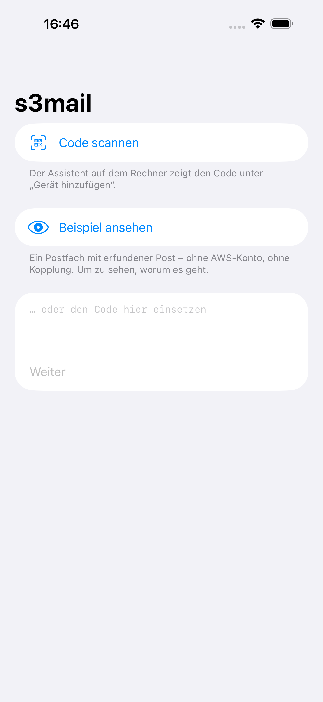
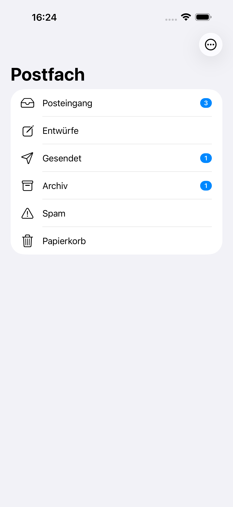
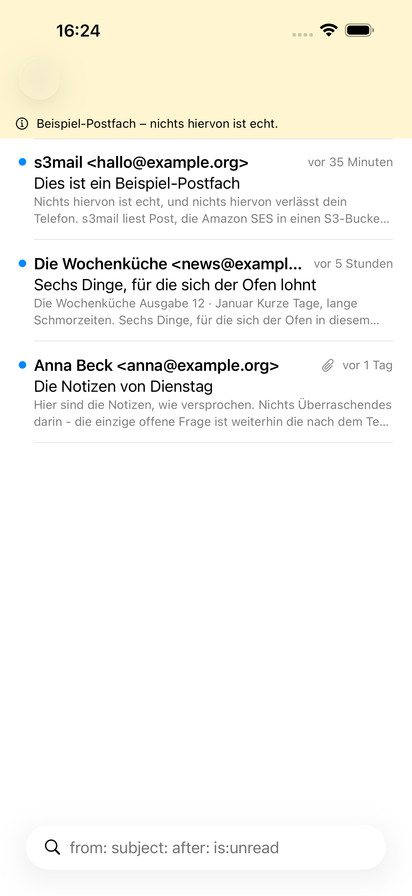
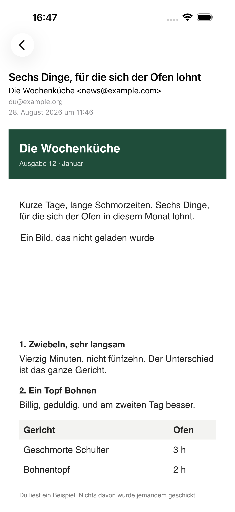

<!--
SPDX-FileCopyrightText: 2026 Kai Ole Hartwig <mail@ole-hartwig.eu>
SPDX-License-Identifier: Apache-2.0
-->

# s3mail for iPhone and iPad

The native app for [s3mail](https://github.com/ohartwig/s3mail): mail that
Amazon SES writes into an S3 bucket you own, read on the phone. There is no
server in between — the app talks to the bucket directly, with an IAM user and
a key of its own, and the Go core that runs on the desktop runs here too.

> **Auch auf Deutsch:** [`README.de.md`](README.de.md) is the build diary —
> what was built in which order, and why that way. This page is the short
> entrance.

<p>
  
  
  
  
</p>

## What it does

- **Pairing by QR code.** The desktop writes the IAM policy for the phone and
  shows a code; the key in it is sealed and opened with a PIN typed on the
  phone. A photograph of the screen is not access.
- **One IAM user per device**, capped at that mailbox's prefix. Losing a
  phone is one revocation in the IAM console; the desktop keeps working.
- **Folders, list, reading** — including HTML mail in a sandboxed view — and
  **writing, replying, forwarding and sending** through SES. Drafts are real
  messages in `drafts/`, so the desktop sees them without any sync.
- **Several mailboxes** on one phone, and **push** when new mail arrives.
- **A sample mailbox** to look at before owning a bucket.

The phone shows and moves; deleting is a decision for the desktop and stays
there. The credentials live in the keychain with
`WhenUnlockedThisDeviceOnly`: unreadable while the phone is locked, never
restored onto a second device.

## How it is built

```text
mobile/            Go: the facade Swift sees, bound with gomobile. Its own
                   module, because gomobile needs golang.org/x/mobile and the
                   core takes nothing beyond the standard library, the AWS SDK
                   and go-message.
Sources/S3mailKit  Swift above the bridge: mailbox, views, the string catalogue
Tests/             XCTest against the same ugly mails as the Go corpus
ios-app/           the app: project file, sources, the tests that need a host
```

The core is not rewritten in Swift. `gomobile bind` turns `core`, `mimeparse`,
`store` and the AWS SDK into an XCFramework; MIME parsing — Outlook multiparts,
`winmail.dat`, three character sets in one subject line — exists exactly once,
in Go. The bridge returns codes, not sentences (`send_not_permitted`): which
language applies is the phone's decision, and the catalogue under
`Sources/S3mailKit/Resources` carries `de`, `en` and `es`.

## Building

Xcode with the iOS SDK, an iOS simulator runtime
(`xcodebuild -downloadPlatform iOS`) and Go 1.27. `gomobile` is built into
`.bin` from the version pinned in `mobile/go.mod`, not installed by hand.

The core is a dependency like any other: `mobile/go.mod` requires
`github.com/ohartwig/s3mail` at a version, and a new core version arrives as
a dependency update with its own merge request. To work against an untagged
core, use a `go.work` beside the checkout — not a `replace` in
`mobile/go.mod`, which would take everyone with it.

```sh
make framework     # the XCFramework, 26 MB, built and never committed
make test          # package tests in the simulator
make app           # the app
make app-test      # the tests that need a host app (keychain)
make shots         # the App Store screenshots, from a UI test
```

The tests against a real mailbox run only with credentials in the
environment, and `xcodebuild` passes **only** variables prefixed
`TEST_RUNNER_` to the test bundle; without the prefix they skip silently
while the summary says "passed":

```sh
TEST_RUNNER_S3MAIL_KEY=… TEST_RUNNER_S3MAIL_SECRET=… \
TEST_RUNNER_S3MAIL_REGION=eu-north-1 \
TEST_RUNNER_S3MAIL_BUCKET=… TEST_RUNNER_S3MAIL_PREFIX="mail/ole/" \
make test
```

## Pipeline

Two halves, and the split is the point. The Go side of the bridge needs no
Mac: formatting, `vet` and a build run on an ordinary Linux runner, and that
is where the errors happen that one would otherwise wait twenty minutes on a
Mac for — a signature that changed, a field the facade no longer knows.
Everything with Xcode runs on a Mac runner and only when one is registered.

## Contributing

Bugs and ideas go to the [issues](https://github.com/ohartwig/s3mail-ios/issues),
changes as pull requests; [`CONTRIBUTING.md`](CONTRIBUTING.md) says what a
change brings with it. Vulnerabilities go to <security@ole-hartwig.eu>, not
into an issue — see [`SECURITY.md`](SECURITY.md).

## Where this lives

The canonical public home is <https://github.com/ohartwig/s3mail-ios>.
Development and the pipeline run on the author's GitLab, which mirrors here —
pull requests are read on GitHub and land through the mirror, so a merge may
take a day. The app itself is distributed through the App Store.

## Licence

Apache-2.0, like the core — see [`LICENSE`](LICENSE) and [`NOTICE`](NOTICE).
Every source file carries the SPDX identifier; the repository is
[REUSE](https://reuse.software/) compliant.
